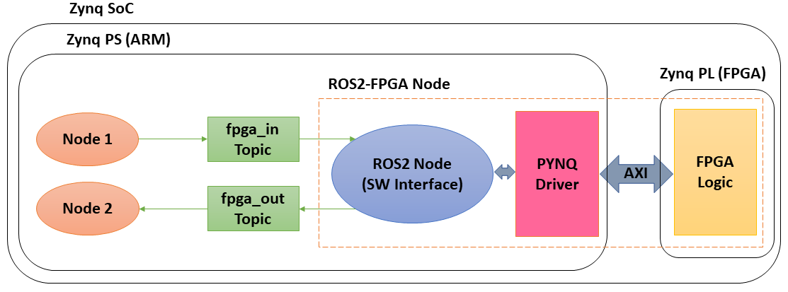

# Authors

**Authors:** Daniel Pinheiro Leal (University of Toronto), Midori Sugaya (Shibaura Institute of Technology), Hideharu Amano (Keio University), Takeshi Ohkawa (Tokai University).

**Contact Information:** daniel.leal_at_mail.utoronto.ca and ohkawa.takeshi_at_tokai.ac.jp (Replace \_at\_ with @).

# ROS2 - Forest

**FOrEST** (FPGA-Oriented Easy Synthesizer Tool) is a tool that allows an easy and seamless integration of HLS-generated FPGA logic into [ROS2](https://index.ros.org/doc/ros2/) systems. It automatically generates a ROS2-FPGA node, which can be used to accelerate versatile and robust real-world robot applications.

The diagram of a Forest-generated ROS2-FPGA node is shown below. Forest automatically creates a PYNQ driver to communicate between ROS2 and FPGA, and generates and builds 
all of the files necessary to encompass the FPGA logic within a ROS2 package, allowing it to be easily accessible to other ROS2 nodes running on the PS part of an FPGA SoC
or even distributed ROS2 nodes that communicate with the FPGA SoC PS over a network.



Below you can see an example of a Forest-generated ROS2 node that makes use of FPGA hardware to perform the MNIST digit recognition task through a convolutional neural network. The output of the FPGA CNN hardware (FPGA prediction) is printed to the terminal by another ROS2 node, which runs on a PC.


## Environment

For the installation of PYNQ and ROS2 Eloquent on the Zynq boards, please refer to the step-by-step [setup guide](https://github.com/ros2-forest/forest/tree/master/docs/setup_guide).

#### PYNQ

Forest runs on [PYNQ version 2.5](https://pynq.readthedocs.io/en/v2.5/index.html).

#### Python

Tested with Python 3.6.

#### Required Python Packages

The following Python packages are required:

`pip3 install numpy jinja2`

#### ROS2

[ROS2 Eloquent](https://index.ros.org/doc/ros2/Installation/Eloquent/Linux-Development-Setup/), built from source.

#### Vivado

Tested with designs from Vivado 2019.1 and Vivado HLS 2019.1.

## Installation

Go through the [Setup Guide](https://github.com/ros2-forest/forest/tree/master/docs/setup_guide) to install PYNQ v2.5 and ROS2 Eloquent, and then get the Forest tool in your Zynq board by cloning the Github repository.

`git clone https://github.com/ros2-forest/forest.git`

## Usage

```
python3 forest.py [-h] [-t] [-g -i ninputs -o noutputs]

-h or --help: Prints the usage statement for the script

-t or --test: Generates simple talker and listener nodes along with the FPGA ROS node

-g or --genconfig: Generates a template config file to be used by the script

-i or --ninputs: Number of input signals for the template config file

-o or --noutputs: Number of output signals for the template config file
```

## Tutorial

See the [Getting Started](https://github.com/ros2-forest/forest/tree/master/docs/tutorials) tutorial.

## Examples

1. [Image Processing - Contrast Stretching](https://github.com/ros2-forest/forest/tree/master/examples/contrast_stretch)

2. [Machine Learning - BNN for MNIST digit recognition](https://github.com/ros2-forest/forest/tree/master/examples/mnist_bnn)

3. [Machine Learning - CNN for MNIST digit recognition](https://github.com/ros2-forest/forest/tree/master/examples/mnist_cnn)

# Publications

If you are using or modifying the Forest tool, please cite this GitHub repository and our related publications.

- [1] - D. Pinheiro Leal, M. Sugaya, H. Amano, T. Ohkawa "Automated Integration of High-Level Synthesis FPGA Modules with ROS2 Systems", International Conference on Field Programmable Technology (FPT), 2020. 

- [2] - D. Pinheiro Leal, M. Sugaya, H. Amano, T. Ohkawa "FPGA Acceleration of ROS2-Based Reinforcement Learning Agents", CANDAR'20 - 8th International Workshop on Computer Systems and Architectures (CSA'20), 2020.
